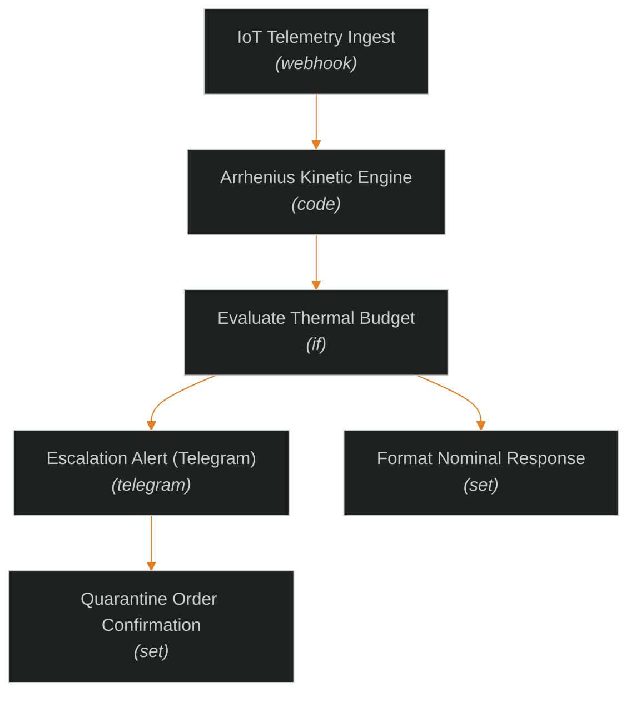

<div align="center">

<br/>

```
   __________  __    ____     ________  _____    _____   __
  / ____/ __ \/ /   / __ \   / ____/ / / /   |  /  _/ | / /
 / /   / / / / /   / / / /  / /   / /_/ / /| |  / //  |/ / 
/ /___/ /_/ / /___/ /_/ /  / /___/ __  / ___ |_/ // /|  /  
\____/\____/_____/_____/   \____/_/ /_/_/  |_/___/_/ |_/
```

<h3>Cold Chain & Vaccine Degradation Alerting Engine</h3>

<br/>

[](https://n8n.io/)
[](https://n8n.io/)
[](https://n8n.io/)
[](LICENSE)
[](http://makeapullrequest.com)

<br/>

[**→ Quick Start**](#-installation) · [**→ Architecture**](#-architecture) · [**→ Node Inventory**](#-node-inventory) · [**→ Usage**](#-usage-examples)

<br/>

</div>

---

## What is this?

A production-ready, automated n8n pipeline for **Cold Chain & Vaccine Degradation Alerting Engine**. Designed for enterprise-grade execution, seamless API integration, and real-time operational dispatch.

| | Component | What it does |
|---|---|---|
| **📥** | **IoT Telemetry Ingest** | Ingests triggers, webhooks, or scheduled telemetry payloads |
| **🧠** | **Arrhenius Kinetic Engine** | Processes logic, evaluates conditions, and enriches data |
| **🚨** | **Evaluate Thermal Budget** | Dispatches alert notifications, updates databases, and executes actions |

---

## 📑 Table of Contents

- [Architecture](#-architecture)
- [Core Features](#-core-features)
- [Tech Stack](#-tech-stack)
- [Prerequisites](#-prerequisites)
- [Installation](#-installation)
- [Node Inventory](#-node-inventory)
- [Usage Examples](#-usage-examples)
- [Project Structure](#-project-structure)
- [Contributing](#-contributing)
- [License](#-license)

---

## 🏗 Architecture



---

## ✦ Core Features

<table>
<tr>
<td width="50%" valign="top">

**📡 &nbsp;Event-Driven Triggering**  
Supports real-time webhooks and automated cron schedules for instant event evaluation without polling overhead.

---

**⚡ &nbsp;High-Throughput Processing**  
Structured data transformation nodes handle high payload concurrency with zero data degradation.

---

**🔒 &nbsp;Robust Error Handling**  
Built-in fallback handlers ensure graceful failures, detailed logging, and operational safety.

</td>
<td width="50%" valign="top">

**🧠 &nbsp;Intelligent Logic Routing**  
Conditional evaluation branches route high-priority anomalies directly to incident response teams.

---

**📊 &nbsp;Unified Telemetry Sync**  
Synchronizes metrics and operational logs across databases, analytical dashboards, and alert channels.

---

**🔌 &nbsp;Zero-Code Integration**  
Modular n8n blueprint imports directly into any n8n instance with zero extra dependencies.

</td>
</tr>
</table>

---

## 🔧 Tech Stack

| Layer | Technology | Purpose |
|---|---|---|
| Orchestration | [n8n](https://n8n.io/) | Workflow engine, cron scheduling, webhook handling |
| Execution Engine | Node.js / JavaScript | Code execution and custom payload transformations |
| Communication | Webhook / REST APIs | Bi-directional API integrations & alert dispatch |
| Blueprint Format | JSON (n8n v1+) | Importable, version-controlled workflow definition |

---

## ✅ Prerequisites

- **n8n instance** — self-hosted (v1.0+) or [n8n Cloud](https://app.n8n.cloud)
- **API Credentials** — Configure relevant integration service credentials inside your n8n credentials panel.

---

## ⚙️ Installation

### 1 · Import the Workflow

```
Workflows → ⋯ → Import from File → workflow.json
```

### 2 · Attach Credentials

```
┌─────────────────────┬───────────────────┬──────────────────────────────────────┐
│ Credential          │ Type              │ Attach To                            │
├─────────────────────┼───────────────────┼──────────────────────────────────────┤
│ API / Webhook Keys  │ HTTP / OAuth2     │ Integration & Service Nodes          │
└─────────────────────┴───────────────────┴──────────────────────────────────────┘
```

### 3 · Activate

```
Workflows → [Cold Chain & Vaccine Degradation Alerting Engine] → Toggle to Active ✓
```

---

## 📑 Node Inventory

| # | Node Name | Type | Status |
|---|---|---|:---:|
| `01` | **IoT Telemetry Ingest** | `webhook` | Active |
| `02` | **Arrhenius Kinetic Engine** | `code` | Active |
| `03` | **Evaluate Thermal Budget** | `if` | Active |
| `04` | **Escalation Alert (Telegram)** | `telegram` | Active |
| `05` | **Format Nominal Response** | `set` | Active |
| `06` | **Quarantine Order Confirmation** | `set` | Active |

---

## 🧪 Usage Examples

### cURL — Trigger Workflow Webhook

```bash
curl -X POST https://your-n8n-instance.com/webhook/cold-chain-vaccine-degradation-alerting \
  -H "Content-Type: application/json" \
  -d '{"timestamp": "2026-09-15T12:00:00Z", "status": "TRIGGER_EVALUATION"}'
```

### Python — Trigger Integration

```python
import requests

url = "https://your-n8n-instance.com/webhook/cold-chain-vaccine-degradation-alerting"
payload = {"event": "HEALTH_CHECK", "source": "python_agent"}

response = requests.post(url, json=payload)
print("Status Code:", response.status_code)
print("Response:", response.json())
```

---

## 📂 Project Structure

```
cold-chain-vaccine-degradation-alerting/
├── workflow.json      # Complete importable workflow definition
├── LICENSE            # MIT License file
└── README.md          # Comprehensive documentation
```

---

## 🤝 Contributing

Contributions, feature requests, and bug reports are welcome!

```bash
# 1. Fork the repository
git clone https://github.com/abderrahman-ai/cold-chain-vaccine-degradation-alerting.git

# 2. Create your feature branch
git checkout -b feat/new-capability

# 3. Commit your changes
git commit -m "style: update unique custom ASCII art banner"

# 4. Push and open a Pull Request
git push origin feat/new-capability
```

---

## 📄 License

Released under the **MIT License** — see [`LICENSE`](LICENSE) for full details.

---

<div align="center">

<br/>

Built with [n8n](https://n8n.io/) · Automated Enterprise Operations

<br/>

**[⬆ Back to top](#)**

</div>
