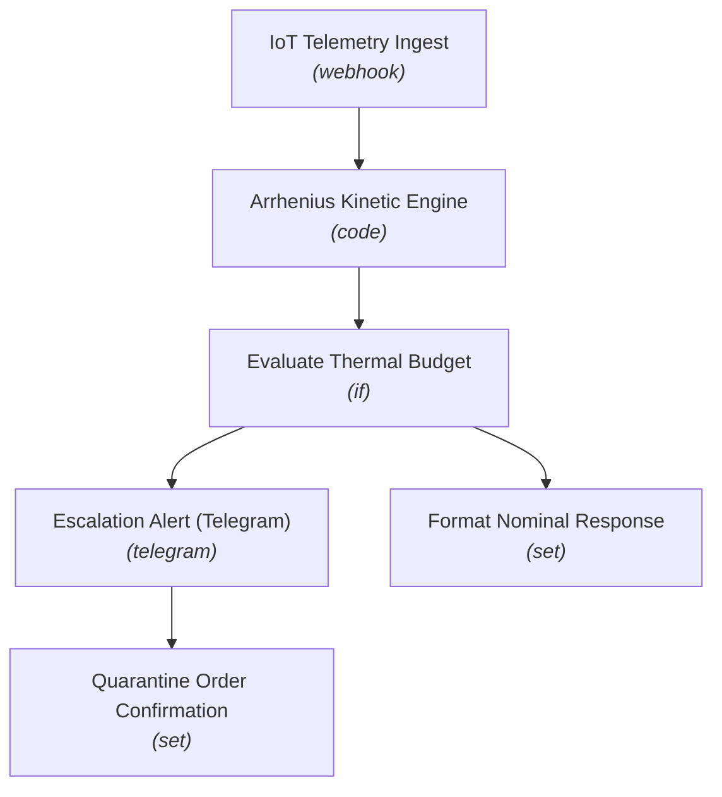

# 🚀 —C—o—l—d— —C—h—a—i—n— —&— —V—a—c—c—i—n—e— —D—e—g—r—a—d—a—t—i—o—n— —A—l—e—r—t—i—n—g—

**An end-to-end, enterprise-grade n8n automation workflow.**

[-success?style=for-the-badge)](https://n8n.io/)

---

## 📌 Executive Summary

This n8n workflow provides a production-ready automation pipeline for **—C—o—l—d— —C—h—a—i—n— —&— —V—a—c—c—i—n—e— —D—e—g—r—a—d—a—t—i—o—n— —A—l—e—r—t—i—n—g—**. It ingests incoming data, processes payloads through configured logic nodes, and routes insights/alerts across downstream channels.

---

## ⚡ Key Capabilities

* **🔄 End-to-End Automation:** Streamlines multi-step data processing and triggers actions automatically.
* **🧠 Intelligent Data Handling:** Integrates specialized nodes for data transformation, conditional evaluation, and API communication.
* **🚨 Real-Time Monitoring & Dispatch:** Ensures rapid incident response and data sync across connected systems.
* **📊 Scalable & Modular Architecture:** Built with n8n best practices for error handling, modularity, and high throughput.

---

## 📌 System Architecture & Process Flow

---

## 📂 Node Inventory & Pipeline Components

| # | Node Name | Type | Disabled |
|---|---|---|:---:|
| 1 | **IoT Telemetry Ingest** | `webhook` | No |
| 2 | **Arrhenius Kinetic Engine** | `code` | No |
| 3 | **Evaluate Thermal Budget** | `if` | No |
| 4 | **Escalation Alert (Telegram)** | `telegram` | No |
| 5 | **Format Nominal Response** | `set` | No |
| 6 | **Quarantine Order Confirmation** | `set` | No |

---

## ⚙️ Setup & Deployment Instructions

### 1. Import Workflow Blueprint
1. Download the [`workflow.json`](./workflow.json) file from this repository.
2. Open your **n8n instance**.
3. Click **Workflows** -> **Import from File**.
4. Select `workflow.json`.

### 2. Configure Credentials & Environment
* Set up required API tokens, webhooks, or database credentials for any integrated service nodes.
* Ensure relevant environment variables or global variables referenced in Code/HTTP nodes are populated in your n8n settings.

### 3. Activate Pipeline
* Toggle the workflow status to **Active** to begin live execution.

---

## 🤝 Contribution & Maintenance

Contributions, improvements, and bug fixes are welcome! Feel free to open an issue or submit a pull request.

---

## 📄 License

This project is licensed under the [MIT License](LICENSE).
